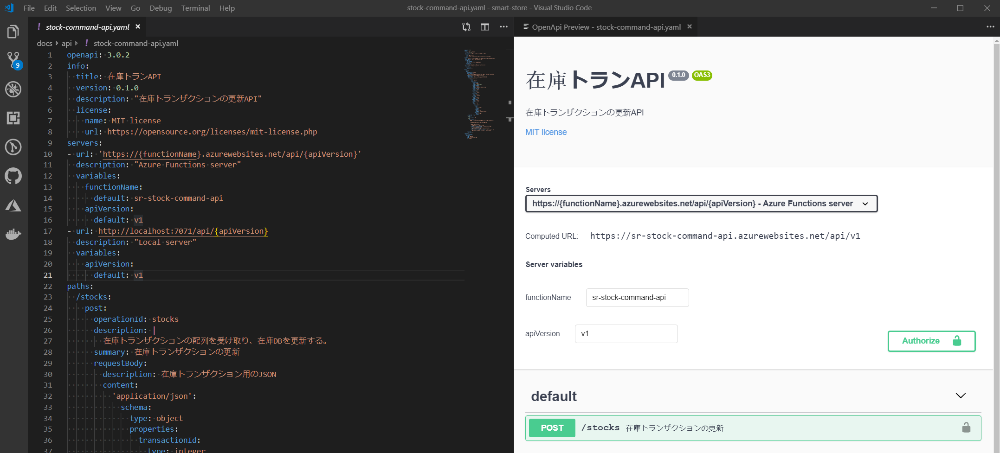
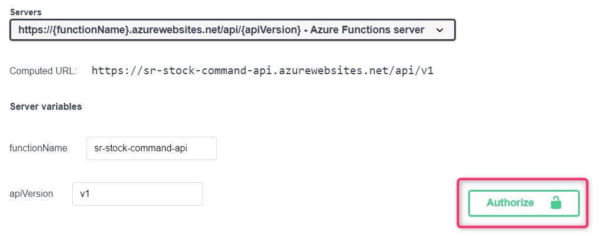
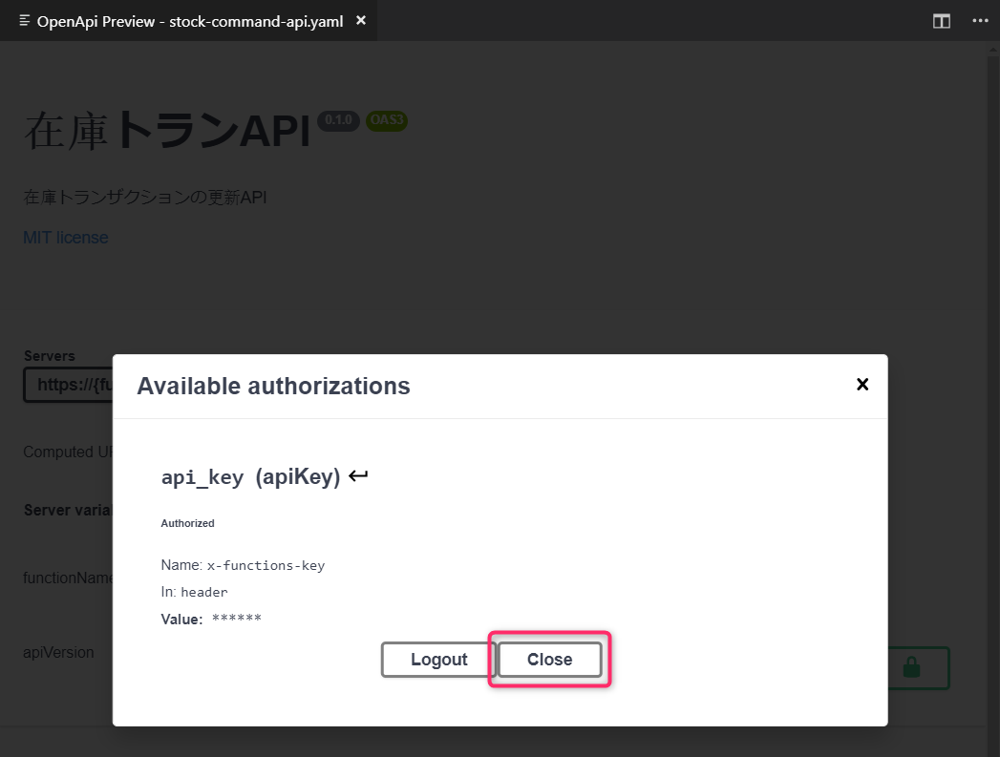
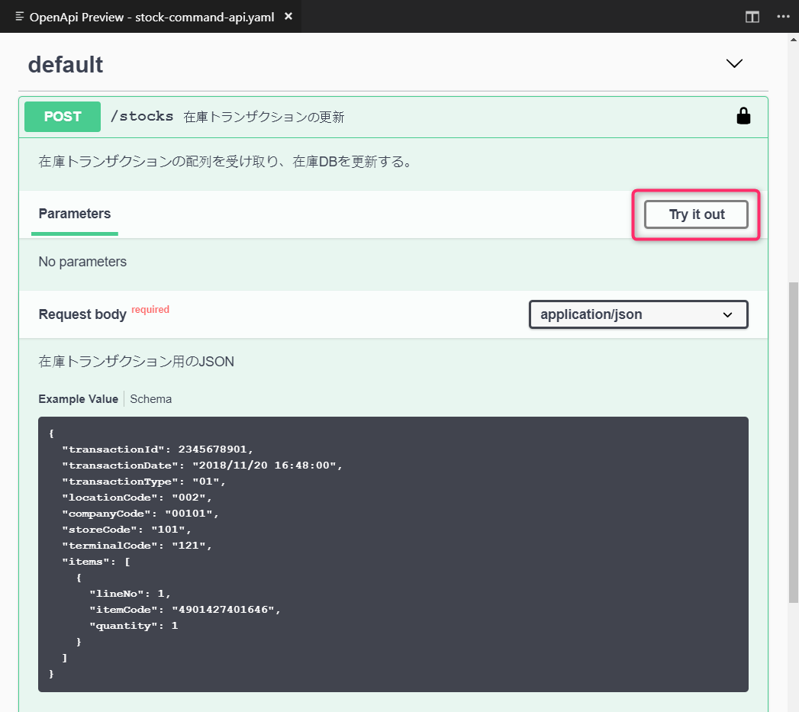
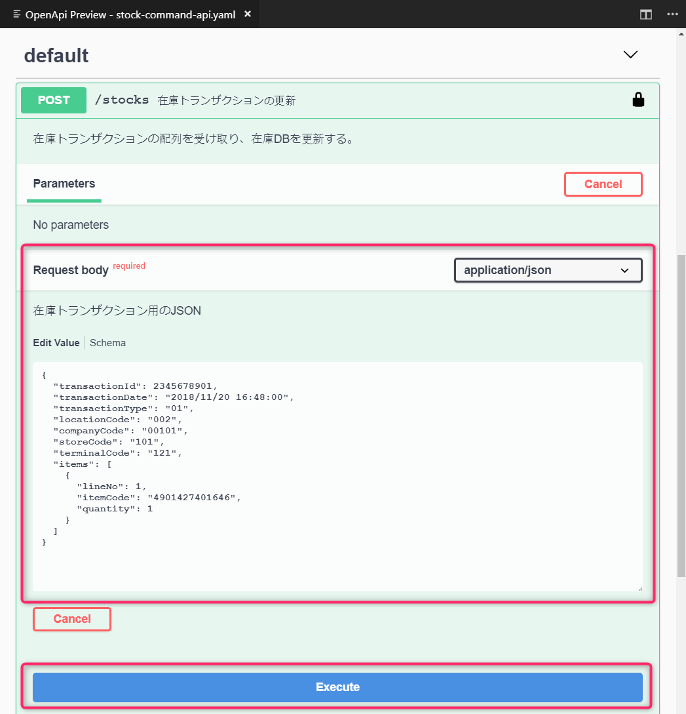

# API定義ファイルの利用方法

## 概要

本プロジェクトにおけるAPI定義は、[OpenAPI Initiative](https://www.openapis.org/) によって管理されている OpenAPI (旧 Swagger) に従い記述しています。OpenAPI は、API定義の記述を統一するための規格です。

- [API Resources | Swagger](https://swagger.io/resources/open-api/)

また、 [Swagger](https://swagger.io/) は OpenAPI に関連するツールを提供しており、そのひとつの [Swagger UI](https://swagger.io/tools/swagger-ui/) はAPI定義を GUI で閲覧でき、ツール上で API を実行することもできます。

ここでは、 Swagger UI の利用方法についてご紹介します。

## Visual Studio Code での Swagger UI の利用

Visual Studio Code では、 Swagger UI を利用できる拡張機能が公開されており、インストールするだけで簡単に利用することができます。

いくつかありますが、ここでは [openapi-designer](https://marketplace.visualstudio.com/items?itemName=philosowaffle.openapi-designer) を利用する手順をご紹介します。

### 拡張機能 Swagger Viewer のインストール

1. [openapi-designer](https://marketplace.visualstudio.com/items?itemName=philosowaffle.openapi-designer) を開き、「Install」ボタンをクリックします。
1. _Visual Studio Code_ を開いてよいかメッセージが表示される場合は、許可します。
1. _Visual Studio Code_ が開き、 _openapi-designer_ のページが開くので、「Install」ボタンをクリックします。

### 拡張機能 OpenAPI Designer でAPI定義を GUI で表示する（Swagger UI）

1. API定義ファイル（例: `docs/api/stock-command-api.yaml` ）を開きます。
1. `Ctrl + Shift + p` キーを押下し、 _Command Palette_ を開きます。
1. `OpenAPI Designer: Preview` と入力し、表示された選択候補を選択します。すると、右に新しいペインが作られ、 Swagger UI が表示されます。

## Swagger UI で API を実行する

Swagger UI 上で、APIを実行することができます。

1. OpenAPI Designer で利用したいAPI定義を開きます。
1. APIの認証設定が必要なので、「Authorize」ボタンをクリックします。
 
1. `x-functions-key` の `Value` にキー(※)を入力し、「Authorize」ボタンをクリックします。
 
   - ※ `x-functions-key` には、 Azure Function の _Function Key_ の値を指定します。ポータルなどから取得するか、管理者にお問い合わせください。
1. 「Close」ボタンをクリックして閉じます。
 
1. 試したいAPIをクリックして詳細を開き、「Try it out」ボタンをクリックします。
 
1. 必要に応じてパラメータを設定し、「Execute」ボタンをクリックすると、APIが実行されます。
 
